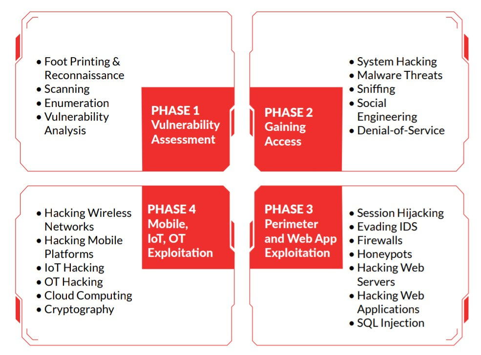
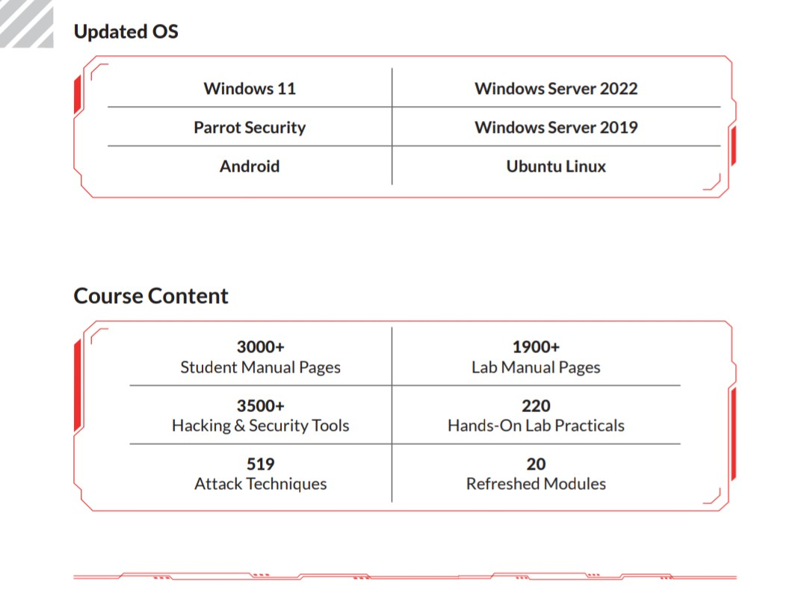

## CAEH - CERTIFIED ADVANCED ETHICAL HACKERS
### Course Overview
##### Certified Advanced Ethical Hackers (CAEH) is a certification program for an information security professional, also referred to as a white-hat hacker, who systematically attempts to inspect network infrastructure with the consent of its owner to find security vulnerabilities which a malicious hacker could potentially exploit. The program helps you assess the security posture of an organization by identifying vulnerabilities in the network and system infrastructure to determine if unauthorized access is possible. The Certified Ethical Hacker program is the most comprehensive Ethical Hacking program in the world. It is the first of three programs within our Vulnerability Assessment and Penetration Testing (VAPT) track. This program will upskill you on the most advanced tools and techniques used by black and grey hat hackers alike to break into an organization to assess, document, and remediate vulnerabilities from a vendor neutral perspective. CAEH will put you in the driver&rsquo;s seat of an interactive, hand&rsquo;s-on learning environment that challenges you to test the integrity of systems and networks by hacking them!

##### CAEH v1 training program includes 20 modules covering various technologies, tactics, and procedures, providing prospective ethical hackers with the core knowledge needed to thrive in cybersecurity. Delivered through a carefully curated training plan that typically spans five days, the 12th version of the CAEH continues to evolve to keep up with the latest OS, exploits, tools, and techniques. The concepts covered in the training program are split 50/50 between knowledge-based training and hands-on application through our cyber range.Every tactic discussed in training is backed by step-by-step labs conducted in a virtualized environment with live targets, live tools, and vulnerable systems. Through our lab technology, every participant will have comprehensive hands-on practice to learn and apply their knowledge.”

 

### Course Outline :
##### 20 Modules That Help You Master the Foundations of Ethical Hacking and Prepare to Take the CAEH Certification Exam

- Module 01 : Introduction to Ethical Hacking - Cover the fundamentals of key issues in the information security world, including the basics of ethical hacking, information security controls, relevant laws, and standard procedures.

- Module 02 : Foot Printing and Reconnaissance - Learn how to use the latest techniques and tools to perform foot printing and reconnaissance, a critical pre-attack phase of the ethical hacking process.

- Module 03 : Scanning Networks - Learn different network scanning techniques and countermeasures.

- Module 04 : Enumeration - Learn various enumeration techniques, such as Border Gateway Protocol (BGP) and Network File Sharing (NFS) exploits, and associated countermeasures.

- Module 05 : Vulnerability Analysis - Learn how to identify security loopholes in a target organization’s network, communication infrastructure, and end systems. Different types of vulnerability assessment and vulnerability assessment tools.

- Module 06 : System Hacking - Learn about the various system hacking methodologies—including steganography, steganalysis attacks, and covering tracks—used to discover system and network vulnerabilities.

- Module 07 : Malware Threats - Learn different types of malware (Trojan, virus, worms, etc.), APT and fileless malware, malware analysis procedure, and malware countermeasures.

- Module 08 : Sniffing - Learn about packet-sniffing techniques and how to use them to discover network vulnerabilities, as well as countermeasures to defend against sniffing attacks.

- Module 09 : Social Engineering - Learn social engineering concepts and techniques, including how to identify theft attempts, audit human-level vulnerabilities, and suggest social engineering countermeasures.

- Module 10 : Denial-of-Service - Learn about different Denial of Service (DoS) and Distributed DoS (DDoS) attack techniques, as well as the tools used to audit a target and devise DoS and DDoS countermeasures and protections.

- Module 11 : Session Hijacking - Understand the various session hijacking techniques used to discover network-level session management, authentication, authorization, and cryptographic weaknesses and associated countermeasures.

- Module 12 : Evading IDS, Firewalls, and Honeypots - Get introduced to firewall, intrusion detection system (IDS), and honeypot evasion techniques; the tools used to audit a network perimeter for weaknesses; and countermeasures.

- Module 13 : Hacking Web Servers - Learn about web server attacks, including a comprehensive attack methodology used to audit vulnerabilities in web server infrastructures and countermeasures.

- Module 14 : Hacking Web Applications - Learn about web application attacks, including a comprehensive web application hacking methodology used to audit vulnerabilities in web applications and countermeasures.

- Module 15 : SQL Injection - Learn about SQL injection attacks, evasion techniques, and SQL injection countermeasures.

- Module 16 : Hacking Wireless Networks - Understand different types of wireless technologies, including encryption, threats, hacking methodologies, hacking tools, Wi-Fi sedcurity tools, and countermeasures.

- Module 17 : Hacking Mobile Platforms - Learn Mobile platform attack vector, android and iOS hacking, mobile device management, mobile security guidelines, and security tools.

- Module 18 : IoT and OT Hacking - Learn different types of IoT and OT attacks, hacking methodology, hacking tools, and countermeasures.

- Module 19 : Cloud Computing - Learn different cloud computing concepts, such as container technologies and server less computing, various cloud computing threats, attacks, hacking methodology, and cloud security techniques and tools.

- Module 20 : Cryptography - Learn about encryption algorithms, cryptography tools, Public Key Infrastructure (PKI), email encryption, disk encryption, cryptography attacks, and cryptanalysis tools.

 

### Your Mission
##### Whether this is your first engagement or you’re honing your skills, get ready to test your ethical hacking knowledge like never before! Once you’ve practiced through the hands-on guided labs, it’s time to apply your knowledge, take on the hacker persona, and find the vulnerabilities and weaknesses in ABCDorg—all built in our CAEH Engage (practice range).

### Objectives:
##### Armed with your attack platform, Parrot OS, and a plethora of tools used by Ethical Hackers, you will embark on a 4-part engagement to assess ABCDorg’s security posture. Follow the process, practice your TTP and experience the real thing in a controlled environment with no consequences, just the ultimate learning experience to support your career as an Ethical Hacker! Each phase builds on the last as you progress through your ABCDorg’s engagement.

##### Put Your Skills and Knowledge to the Test With the CAEH Master Once you have achieved the certification and completed your ethical hacking engagement, you are ready to challenge the proctored CAEH practical assessment and become a CAEH Master!

### New Challenges Every Month!

- October - OWASP Top 10 Web Application Threat Vectors
- November - Ransomware/Malware Analysis
- December - Outdated/Unpatched Software
- January - System Hacking and Privilege Escalation
- February - Web Application Hacking and Pen Testing
- March - Cloud Attack/Hacking
- April - Social Engineering/Phishing attacks
- May - IoT Attack/Hacking
- June - Wi-Fi Network Attack/Hacking
- July - DOS/DDoS Attack
- August - Mobile Attack/Hacking
- September - Supply Chain Cyber Attacks

### Common Job Roles for CAEH

- Mid-Level Information Security Auditor
- Cybersecurity Auditor
- Security Administrator
- IT Security Administrator
- Cyber Defense Analyst
- Vulnerability Assessment Analyst
- Warning Analyst
- Information Security Analyst 
- Security Analyst
- Cybersecurity Analyst
- Network Security Engineer
- SOC Security Analyst
- Security Analyst
- Network Engineer
- Senior Security Consultant
- Information Security Manager
- Senior SOC Analyst
- Solution Architect
- Cybersecurity Consultant

